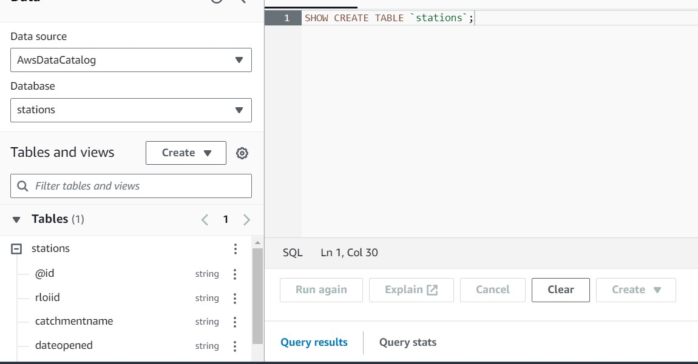
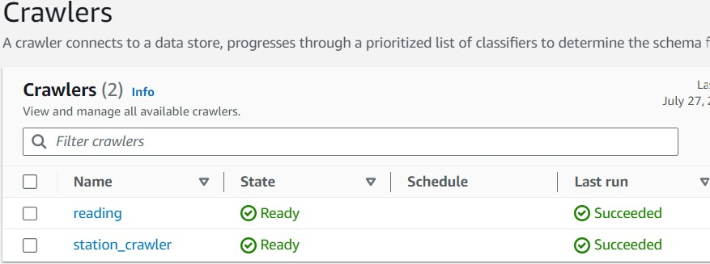
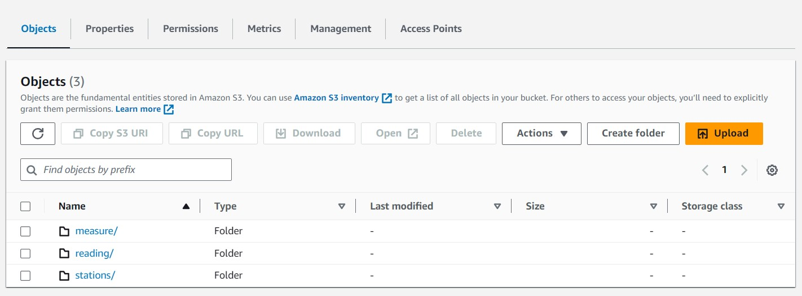

## Please provide your justification for the technologies used and explain your thought process:

1. Technologies Used

- Python for data processing
- EC2 for cloud computing
- Amazon S3 for data lake
- AWS Athena 
- AWS Glue

2. Justification

- I am going to use Python for data processing, because I think python is easy to use and quickly development.
- For EC2, it is realiable, flexibiale and secure.
- S3 for data lake, it is really flexible and secure. I will implement least privilege access for our raw data in data lake
- AWS Glue can build connect S3 raw data to data warehouse(AWS Athena, or RDS)
- AWS Athena can connect  to data in S3 using AWS Glue Data Catalog


## Please explain how you would deploy this solution to the cloud to run on recurrence and to publish the dataset in a way that can be served to other internal applications, Data Analysts and Data Scientists


we can deploy the script on EC2 or local machine for testing, but you have to change the value in file [datafetcher.py](datafetcher.py). **you have to change the this line**.:

```python
domain = "YOUR_S3_BUCKET_NAME"
```
the database can be provided in AWS as image shows 


1. Create an AWS account and configure the necessary permissions.
2. Create an EC2 instance and install Python.
3. we can consider about EC2 fleet/spot Fleet
4. Schedule the data pipeline to run on a recurring basis such as 15 min based on [Doc](https://environment.data.gov.uk/flood-monitoring/doc/reference).
5. set up S3 to fill into code
6. build AWS Glue for provide database to Data Analysts and Data Scientists


## Should the volume of stations increase by 100 times how would your approach change?

I would like to change code slightly, we can call function **fetch_station_data()** firstly, then based on the list of station to get measures and last reading

Then, I will think about avoid to write a record if last reading not changed, it will reduce databased writing rate.

if nesseary, I will consider about introducing Kafka.

Third, I will deploy mutiple EC2 instance to run different reading requests split by station, for example, 1 instance run 20% stations' measures, etc.


## If there was a requirement to live-stream the data, how would your approach change?

firstly, I need to make sure the requests' frenqunce to live-stream, if we think about few mins. we need to introduce kafka/Spark and Auto Scaling Groups.


## How would you implement an update strategy that captures the new reading for each station ensuring there is always a maximum of 24 hours’ worth of data retained for each?:

firstly, I would delete/ move older data from S3 to S3 Glacier, it will keep our data lake always a maximum of 24 hours' worth of data. Then, I will schedul the script to run within 24 hours(even 15 min per requests)

## Please briefly explain how you would implement CI/CD and version control
I will write a docker files and sh file to auto create EC2 and deploy on it. Or, I can use codePipeline and Elastic Beanstalk to implement CI/CD, and use Github to version control


please find my **example data under data_example** folder,
I also attached screenshot for Glue 
and S3 